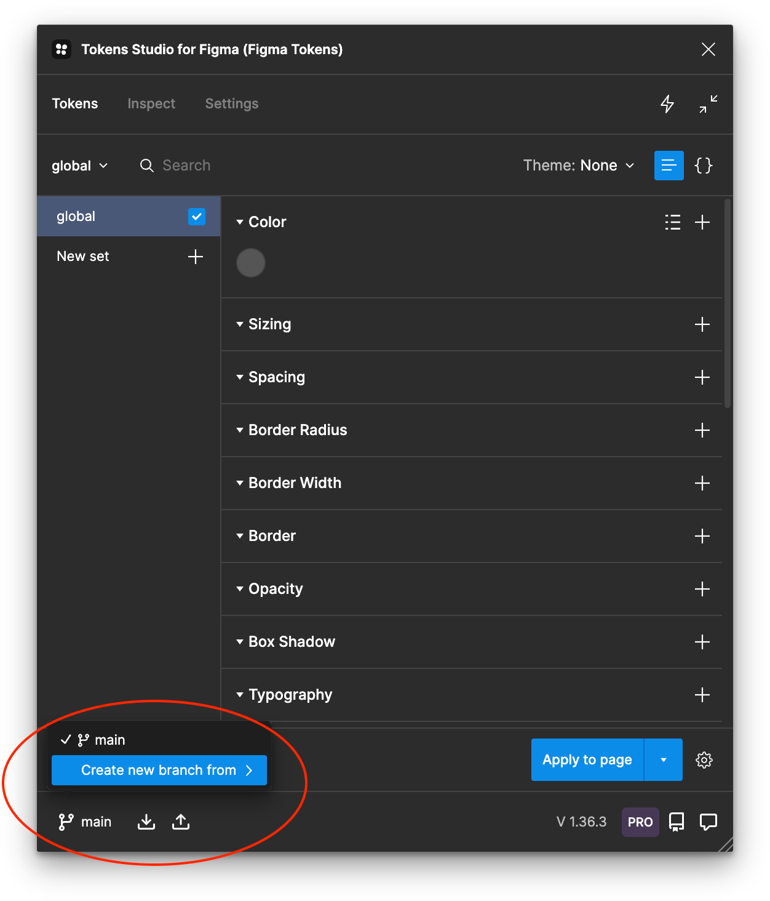

# token-flow-demo

This is a minimal demonstration of how design tokens are created and managed in Figma using the [Tokens Studio](https://tokens.studio/) plugin, pushed to GitHub, published to GitHub Packages, transformed into platform-specific formats, and consumed by applications.

Note for the sake of simplicity this example publishes a CSS and JavaScript file. The `build.js` file can be updated to include other platforms and transforming options. See https://github.com/tokens-studio/sd-transforms.

## Requirements

1. A [Tokens Studio Pro](https://tokens.studio/#pricing-2) account. This is the Figma plugin where we’ll manage the design tokens.
2. Create a GitHub [Personal Access Token](https://github.com/settings/tokens) with at least `read:packages` and `write:packages` permissions. See [About permissions for GitHub Packages](https://docs.github.com/en/packages/learn-github-packages/about-permissions-for-github-packages#about-scopes-and-permissions-for-package-registries) for more. You'll need token for the next step and step 2 in "Tokens Studio setup" below.
3. Add the Personal Access Token to your personal `~/.npmrc` file with `//npm.pkg.github.com/:_authToken=TOKEN`. See [Authenticating with a personal access token](https://docs.github.com/en/packages/working-with-a-github-packages-registry/working-with-the-npm-registry#authenticating-with-a-personal-access-token).
4. In the `package.json` make sure a `publishConfig` entry is present according to the [GitHub Packages instructions](https://docs.github.com/en/packages/working-with-a-github-packages-registry/working-with-the-npm-registry).

## Steps

### Tokens Studio setup

1. In Figma, run Tokens Studio and in the Settings tab, find "Sync providers" and click “Add new”. Add a GitHub provider and enter the repository information along with the GitHub Personal Access Token you created above.

2. If the settings connect correctly you should see the GitHub options in the bottom left of the Tokens Studio plugin.

3. You should now be able to pull changes from the `main` branch with the down arrow icon.

### Tokens Studio changes

1. Create a new branch off of `main` in the lower-left corner. We want to use the standard GitHub workflow of branching and creating Pull Requests. The `main` branch should be [protected](https://docs.github.com/en/repositories/configuring-branches-and-merges-in-your-repository/managing-protected-branches/managing-a-branch-protection-rule).

2. After a token has been changed you'll see a blue dot in the lower left corner of the plugin. This means there are un-pushed changes in your branch. Click that icon and you'll be asked to enter a commit message.

3. After a successful push you'll be asked to create a Pull Request. Click "Create Pull Request" and go to the repository on GitHub to start the review and merge process.

### GitHub review and publish package

1. Review the [Pull Request](https://github.com/tomgenoni/token-flow-demo/pulls) in GitHub with the standard workflow.

2. Once the branch has been merged you are now ready to publish.

3. Pull the new changes in the `main` branch to your local copy of the repository.

4. Open `package.json` and update the `version` according to [Semantic Versioning](https://semver.org/) best practices.

5. Run `npm publish` and this will create a new GitHub Package with the updated version number.

6. On successful publish a new package will be created and visible in the [repository](https://github.com/tomgenoni/token-flow-demo/pkgs/npm/token-flow-demo).

7. You'll need to push the updated `package.json` back to the `main` branch.

Note that at this point the token files are still [JSON files](https://github.com/tomgenoni/token-flow-demo/tree/main/src) and not ready to consume.

### Consuming

1. In your application, run `npm install @tomgenoni/token-flow-demo`. A `postinstall` script runs [`build.js`](https://github.com/tomgenoni/token-flow-demo/blob/main/build.js) and this is what produces the platform-specific files, in this case CSS file and a JavaScript file.

2. Inspect `node_modules/@tomgenoni/token-flow-demo/dist/` in your application to view the distribution files.

3. You can now import to your application.

## Automating package publishing

This process as described above is entirely manual. To make this process considerably easier and less error-prone you can automate the `npm publish` step with tools like [semantic-release](https://github.com/semantic-release/semantic-release) and [changesets](https://github.com/changesets/changesets). These tools have features like:

- Auto-publishing of new packages that read change severity levels in commit messages
- Auto updates of CHANGELOGs, important for consumers

From what I understand, changesets is preferred as it allows the managing the release to change the messages to ensure that the versioning is correct, though it hasn't been tested yet.
